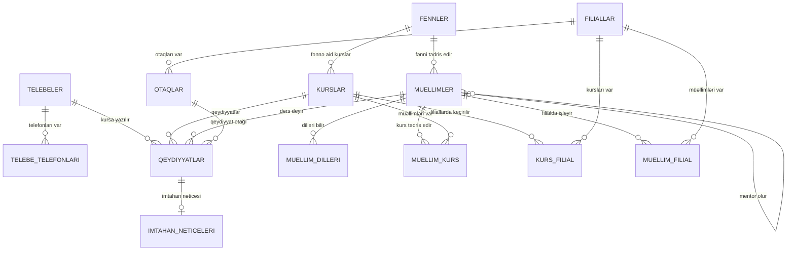

# SQL Task 3

PostgreSQL üzrə kompleks praktiki tapşırıq. Layihədə `AkademiyaOnline`
ssenarisi 1NF-dən 5NF-ə qədər normallaşdırılır və yaranan cədvəllər
üzərində bütün əsas `JOIN` növləri yoxlanılır.

## Mövzular

- 1NF, 2NF, 3NF, BCNF, 4NF ve 5NF
- Funksional, çoxqiymətli və birləşmə asılılıqları
- `PRIMARY KEY`, `FOREIGN KEY`, `UNIQUE`, `CHECK`, `NOT NULL`
- `INNER`, `LEFT`, `RIGHT`, `FULL`, `CROSS`, `SELF` ve `LATERAL JOIN`
- `NATURAL JOIN`, `USING`, `ON`, semi join ve anti join
- `STRING_AGG`, aqreqasiya və pəncərə funksiyaları
- `EXPLAIN (ANALYZE, BUFFERS)`, indeks və trigger testi

## Fayllar

- `pashayev_vaqif_tapsiriq.sql` - bütün tapşırıqlar və izahlar
- `pashayev_vaqif_neticeler.pdf` - icra nəticələri

## Isletmek

```powershell
docker compose up -d
docker compose exec -T postgres psql -v ON_ERROR_STOP=1 -U postgres -d sql_task_3 -f /scripts/pashayev_vaqif_tapsiriq.sql
```

Skripti yenidən işlətmək olar: əvvəlcə tapşırıq üçün yaradılan sxemləri
silir, sonra cədvəlləri və test məlumatlarını yenidən qurur.

## ER diaqramı



Əsas əlaqələr: fənn-kurs `1:N`, fənn-müəllim `1:N`,
tələbə-kurs `M:N`, filial-otaq `1:N`, qeydiyyat-imtahan nəticəsi
`1:0..1`. Tədris planının üçtərəfli əlaqəsi 5NF üçün
`muellim_kurs`, `kurs_filial` və `muellim_filial` cədvəllərinə bölünüb.
